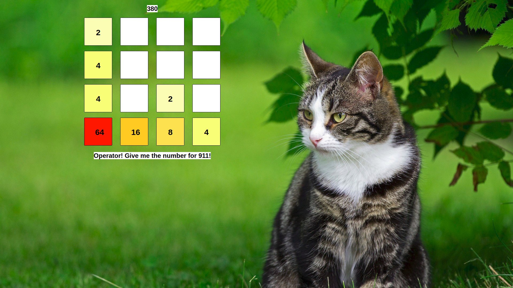

Simple 2048 clone built upon microservices, using Java Spring Boot, Eureka and Zuul.
School project which represents 4 days of work, created for learning new technologies and the microservice architecture.

We can control the game movement with the arrow keys. As the game moves each time we get a different background image.
Under the game board every 3 seconds a new quote appears.

Microservice 1: Front-end - Responsible for server side rendering of the UI and wiring microservices together.

Microservice 2: Game logic - Responsible for the mimicking of the 2048 game movement.

Microservice 3: Random quote - Responsible for supplying random quotes for the user.

Microservice 4: Random picture - Responsible for supplying random pictures for the background.

Microservice 5: Zuul Gateway

Microservice 6: Eureka service

